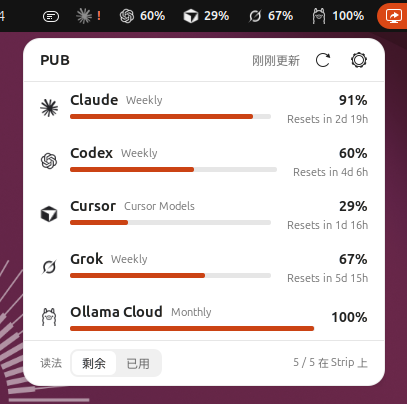
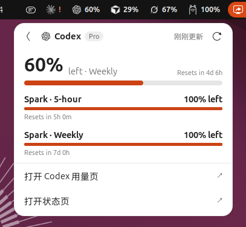
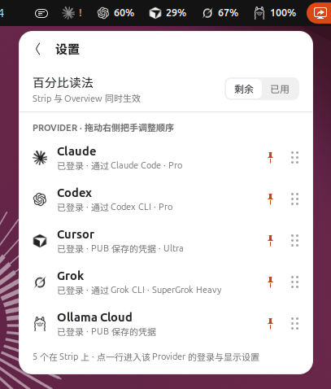

# PUB · Plan Usage Bar

GNOME 顶栏上的 AI 编程套餐额度条。Claude、Codex、Cursor、Grok、Ollama Cloud、OpenCode Go、Command Code 还剩多少，一眼看完。

*A GNOME Shell extension that shows how much of your AI coding plan quota is left — Claude, Codex, Cursor, Grok, Ollama Cloud, OpenCode Go and Command Code — right in the top bar.*

<p>
  
  
  
</p>

## 功能

- **顶栏计量条**：每个固定的 Provider 占一格，图标加剩余百分比。余量不足 20% 变黄，不足 5% 变红。
- **概览与详情**：点开看全部 Provider；点某一家看它所有的额度周期（5 小时、每周、每月等）和重置时间。
- **剩余 / 已用**：全局切换百分比读法。
- **设置**：拖动排序、固定到顶栏、选择顶栏显示哪个额度周期（Primary Window）。
- **登录**：Claude、Codex、Cursor、Grok 调用官方 CLI 在浏览器里授权；Ollama Cloud、OpenCode Go、Command Code 打开官网后粘贴 API key（本机有官方 CLI 时也可登录）。
- **跟随系统**：深浅主题和强调色都跟随 GNOME，Ubuntu 的 Yaru 主题也适配。
- **不注销重载**：改完界面代码，右键「重新加载」立即生效。

## 支持的 Provider

| Provider | 数据来源 | 登录方式 |
| --- | --- | --- |
| Claude | Claude 订阅用量接口 | `claude auth login`，或读取 `~/.claude/.credentials.json` |
| Codex | ChatGPT Codex 用量接口 | `codex login`，或读取 `~/.codex/auth.json` |
| Cursor | cursor.com 用量汇总 | `cursor-agent login`，或读取 `~/.config/cursor/auth.json`，或粘贴 Cookie / JWT |
| Grok | Grok CLI 计费接口 | `grok login --oauth`，或读取 `~/.grok/auth.json` |
| Ollama Cloud | ollama.com 用量接口 | 粘贴 API key，或环境变量 `OLLAMA_API_KEY` |
| OpenCode Go | OpenCode Go `/zen/go/v1/usage` | 粘贴 API key，或读取 `~/.local/share/opencode/auth.json`，或环境变量 `OPENCODE_API_KEY` / `OPENCODE_GO_API_KEY` |
| Command Code | Command Code `/alpha` 账户额度 | 粘贴 API key，或读取 `~/.commandcode/auth.json`，或环境变量 `COMMAND_CODE_API_KEY` / `COMMANDCODE_API_KEY` |

这些接口大多不是公开文档化的 API，服务商改动后可能失效。

## 要求

- GNOME Shell 50（Wayland）
- Node.js 22 或更高，pnpm

## 安装

```bash
git clone https://github.com/NOirBRight/plan-usage-bar.git
cd plan-usage-bar
pnpm install
pnpm build

ln -sfn "$PWD/extension" ~/.local/share/gnome-shell/extensions/plan-usage-bar@noirbright.github.io
```

GNOME Shell 只在启动时扫描新扩展，所以第一次需要**注销再登录**，然后启用：

```bash
gnome-extensions enable plan-usage-bar@noirbright.github.io
```

可选：把 PUB 放进应用列表，点开即启动，右键可以重新加载或退出。

```bash
bash scripts/install-launcher.sh
```

> 不要对指向仓库的软链接执行 `gnome-extensions install`，也不要 `rm -rf` 这个链接，否则会删掉源码。只删链接用 `rm`。

## 使用

- 左键顶栏图标：打开概览。左键某个计量格：直接看这家的详情。
- 右键顶栏图标：立即刷新、设置、重新加载、退出。
- 打开面板只读上次快照。要拉新用量，点右键或面板上的「立即刷新」。登录完成、保存或删除凭据时也会拉一次。

## 隐私与凭据

- 粘贴的凭据保存在 `~/.config/pub/credentials.json`，文件权限 600。
- 通过官方 CLI 登录时，PUB 只读取 CLI 自己写下的凭据文件，不复制、不上传。
- 网络请求只发往各服务商自己的用量接口，没有遥测。
- 快照缓存在 `~/.cache/pub/snapshot.json`。

## 开发

```bash
pnpm test        # 单元测试
pnpm typecheck
pnpm build       # 类型检查并把引擎打包到 extension/bin/pub-engine.mjs
pnpm snapshot    # 手动跑一次引擎，写出快照
```

结构：

- `src/`：TypeScript 引擎。读取凭据、请求各家用量接口，输出一个 Snapshot。
- `extension/extension.js`：很薄的加载器，每次启用时从磁盘重新导入界面代码。
- `extension/pub-ui.js`、`extension/stylesheet.css`：顶栏、面板和设置界面。
- `docs/adr/`：设计决定。`CONTEXT.md`：术语表。`AGENTS.md`：给开发者和 AI 助手的操作说明。

改了 `pub-ui.js` 或样式后不用注销：

```bash
gnome-extensions disable plan-usage-bar@noirbright.github.io; gnome-extensions enable plan-usage-bar@noirbright.github.io
```

想在不影响当前桌面的情况下测试，可以开一个嵌套 GNOME Shell 窗口：

```bash
bash scripts/nested-shell.sh                     # 上游主题
PUB_NEST_MODE=ubuntu bash scripts/nested-shell.sh  # Ubuntu Yaru 主题
```

需要 `mutter-dev-bin` 提供的 `/usr/libexec/mutter-devkit`。

## 许可证

[GPL-2.0-or-later](LICENSE)

Claude、Codex / OpenAI、Cursor、Grok / xAI、Ollama、OpenCode Go、Command Code 的名称与图标归各自所有者，仅用于标识对应服务。本项目与这些公司无关，也未获其认可。
